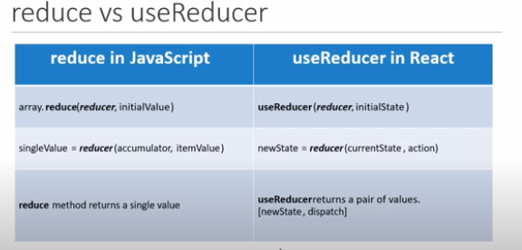
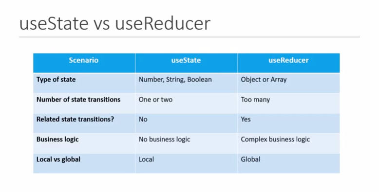

# React Hooks

> ## Snippets

**Extension Name** : ES7 React/Redux/GraphQL/React-Native snippets

<ul>
<li>rce -> Creates a Class based component</li>
<li>rfce -> Creates a Functional component</li>
<li>rconst -> Creates the constructor for the class.</li>
</ul>

---

> ## Hooks

Hooks is a new feature in React 16.8 which allows you to use React features without having to write a class.

### **Why Hooks?**

Problem-1

- Understanding how this keyword works in JavaScript
- Remember to bind event handlers in class Components
- Classes don't minify very well and make hot reloading very unreliable.

Problem-2

- There is no perticular way to reuse stateful compomnent Logic
- HOC and render prop pattern do address this problem but it makes the code harder to follow.
- There is need to share stateful logic in a better way

Problem-3

- When creating component for complex scenarios, the related code is not organised in one place

### **Rules of Hooks**

- **Only call hooks at the top level**. Don't call hooks inside loop, conditions or nested functions.
- **Only call hooks from React functions**. Don't call hooks inside any regular JavaScript function.

## 1 - useState

- useState hook lets you add state in functional component
- In classes the state is always an object
- With useState hook, state does not have to be an object
- New state depends on the previous state values

## 2 - useEffect

The Effect Hook lets you perform side effect in functional Component

It is a close replacement for **_componentDidMount_**, **_componentDidUpdate_** and **_ComponentWillUnmount_**

## 3 - useContext

Context provide a way to pass data through the component tree without having to pass props down manually at every level

## 4 - useReducer

It is a hook used for State Management. It is an alternative for useState. It is a more primitive hook than useState.

## useState vs useReducer

## 5 - useCallback

Is is a hook that will return a memorized version of the callback function that only changes if one of the dependencies has changed.

It is useful when passing callback to optimise child components that rely on refrence equality to prevent the unnecessary re-renders.

{
refrence equality is checking if the functions are equal or not.
}

## 6 - useMemo
You may rely on useMemo as a performance optimization, not as a semantic guarantee. In the future, React may choose to “forget” some previously memoized values and recalculate them on next render, e.g. to free memory for offscreen components.

> Difference between useCallback and useMemo

useCallback caches the provided function instance itself, whereas useMemo invokes the provided function and chaches its result.  
So if you need to cache a function use the useCallback hook, and if you need to cache the results of a function use the useMemo hook.

### 7 - useRef

Commonly used to focus the input fields.
 
Altogether, it can be used to create a generic container whichcan hold a mutable value similar to instance properties of a class components.
 
This generic container does not cause rerenders
when the data it stores changes.
 
At the same time it also remembers the stored data in after other state variable cause a re-render of this component.

### The above hooks are used in most of the cases, apart from these there are three more hooks:- 
 
* ***useImperitiveHandle***
* ***useLayoutEffect***
* ***useDebugValue***