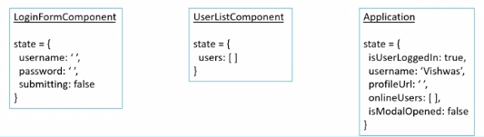
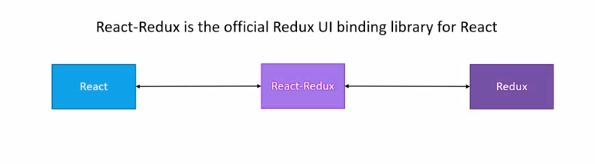

# React Redux

### **Redux is a predictible state container for JavaScript apps.**

React is not specifically tied with React, It can be used with any JavaScript Library, framework and even vanilla JavaScirpt.

Redux Stores the state of your application. State of an app is the state represented by all the individual components of the app.

Redux will store and manage the application status.

**If you want to manage the state of your application in a predictable way, redux can help you**

